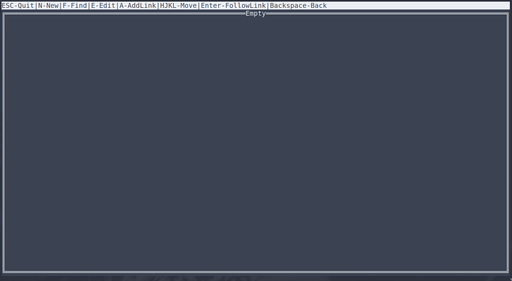

# KN - Simple Zettelkasten tool
This is my personal zettlekasten tool. The idea behind it was I can customise it to only have the features
I want and nothing more.

## Usage
Simply call `kn` to start it.

Set `ZKDIR` environment variable to set where it stores notes.

`kn -a /path/to/file` to add attachments to kn (command returns id).

## Links
You can create links like you would normally in a markdown file. 

You can use the zk: protocol to point to notes by id or zka: to point to attachments.

# Contributions
I probably won't be taking any contributions on this project as it is mostly for my own use.
Feel free to fork it and make your own changes.

